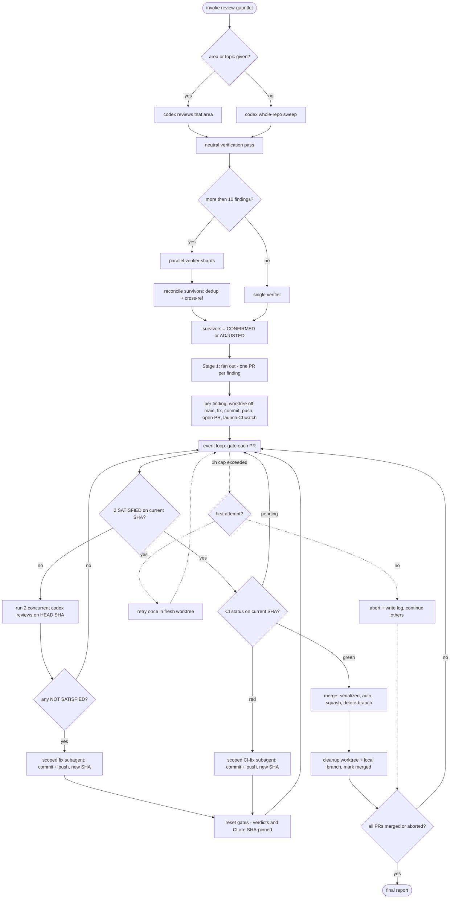

# review-gauntlet

Point it at your code and it runs a tough, end-to-end review cycle for you: an adversarial review
finds problems, each real one gets fixed in its own pull request, every PR is re-reviewed until it
passes a strict quality bar **and** CI is green, and then it merges — all on its own, hands-off.

Think of it as an automated senior reviewer that doesn't just leave comments, but follows through:
files the fixes, defends them through repeated review rounds, waits for CI, and ships.

## What it's good for

- Hardening a codebase or a feature area before a release.
- Turning "someone should really review this" into actual merged fixes.
- Running a thorough pass unattended while you do something else.

## How to use it

```
/review-gauntlet                 # review the whole repo
/review-gauntlet auth & sessions # review just that area or topic
```

Run it **once** — that's it. It schedules its own follow-ups and keeps working until everything is
resolved; you don't need to keep it open or re-run it.

## What to expect

It opens a pull request for each problem worth fixing and merges them itself once they pass two
independent reviews on the same commit and CI is green. There's no approval step along the way, so
starting it is your sign-off — and a whole-repo run can spin up several PRs and keep going for a
while before it's done.

It tidies up as it goes, deleting merged branches and their worktrees. If a fix just can't clear the
bar, it retries once, then sets that one aside with a note on why and moves on rather than stalling
everything else. When it's finished you get a short rundown: what merged, what it gave up on, and
anything it left for you to weigh in on.

## Flow



## Good to know

- It uses Codex as the reviewer, so Codex CLI needs to be available.
- It works through GitHub PRs via the `gh` CLI, so the repo needs a GitHub remote.
- Full mechanics live in [`SKILL.md`](./SKILL.md).
