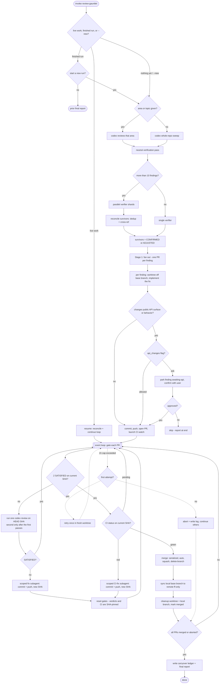

# review-gauntlet

Point it at your code and it runs a tough, end-to-end review cycle for you: an adversarial review
finds problems, each real one gets fixed in its own pull request, every PR is re-reviewed until it
passes a strict quality bar **and** CI is green, and then it merges — all on its own, hands-off.

Think of it as an automated senior reviewer that doesn't just leave comments, but follows through:
files the fixes, defends them through repeated review rounds, waits for CI, and ships.

## What it's good for

- Hardening a codebase or a feature area before a release.
- Turning "someone should really review this" into actual merged fixes.
- Running a thorough pass unattended while you do something else.

## How to use it

```
/review-gauntlet                 # review the whole repo
/review-gauntlet auth & sessions # review just that area or topic
/review-gauntlet --new           # force a brand-new run, even over an old one
```

Run it **once** — that's it. It schedules its own follow-ups and keeps working until everything is
resolved; you don't need to keep it open or re-run it.

If you do come back and run it again later, it does the sensible thing: if a run is still in
progress it picks up where it left off, and if the last run already finished it asks whether you
want to start a fresh one rather than either restarting silently or insisting everything's already
fixed. A fresh run isn't a blind redo — it remembers what earlier runs learned (which findings it
gave up on, which it set aside as your call, and which it judged not worth fixing) so it can pick up
the unfinished threads and not re-litigate the same non-issues. Add `--new` (or just say "start a
fresh run") to force a new run immediately without being asked.

## What to expect

It opens a pull request for each problem worth fixing and merges them itself once they pass two
independent reviews on the same commit and CI is green. There's no approval step along the way, so
starting it is your sign-off — and a whole-repo run can spin up several PRs and keep going for a
while before it's done.

You can follow along on GitHub: each PR is labeled `gauntlet-reviewing` while it's working through
the loop, and that flips to `gauntlet-accepted` once it has passed both reviews (the skill creates
the labels if your repo doesn't have them).

By default it checks with you before changing anything in your public API — exported signatures,
formats, CLI flags, defaults, or any behavior callers depend on — so it never merges a breaking
change behind your back. Tell it up front that breakage is fine and it'll stop asking.

It tidies up as it goes, deleting merged branches and their worktrees. If a fix just can't clear the
bar, it retries once, then sets that one aside with a note on why and moves on rather than stalling
everything else. When it's finished you get a short rundown: what merged, what it gave up on, and
anything it left for you to weigh in on.

## Flow



## Good to know

- It uses Codex as the reviewer, so Codex CLI should be available. If Codex can't return a verdict
  because of a system problem — quota or rate limits, auth, a timeout — it retries once and then does
  the equivalent review with its own subagents, so a transient Codex outage slows a run down but
  doesn't stall it.
- It works through GitHub PRs via the `gh` CLI, so the repo needs a GitHub remote.
- It keeps a small `.review-gauntlet/history.md` at the repo root (git-ignored) to remember what past
  runs learned. That's the memory a fresh run carries over. Each fresh run also tidies that file,
  dropping entries that no longer apply to the current code — and when it isn't sure an entry is
  safe to drop, it asks you first rather than guessing.
- Full mechanics live in [`SKILL.md`](./SKILL.md).
